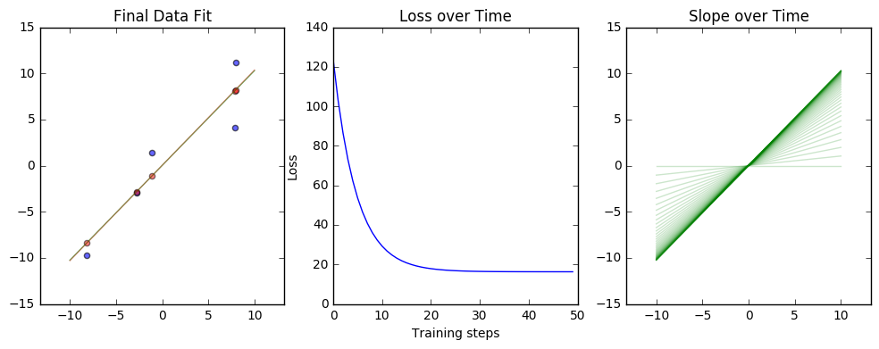

# Simple Linear Regression

* Originally From Getting Started Notebook


```python
#@test {"output": "ignore"}

# Import tf
import tensorflow as tf

# Numpy is Num-Pie n dimensional arrays
# https://en.wikipedia.org/wiki/NumPy
import numpy as np

# Plotting library
# http://matplotlib.org/users/pyplot_tutorial.html
import matplotlib.pyplot as plt

# %matplotlib magic
# http://ipython.readthedocs.io/en/stable/interactive/tutorial.html#magics-explained
%matplotlib inline

# Set up the data with a noisy linear relationship between X and Y.
# Variable?
num_examples = 5
noise_factor = 1.5
line_x_range = (-10,10)

#Just variables in Python
# np.linspace - Return evenly spaced numbers over a specified interval.
X = np.array([
        np.linspace(line_x_range[0], line_x_range[1], num_examples), 
        np.linspace(line_x_range[0], line_x_range[1], num_examples)
    ])

# Plot out the starting data
# plt.figure(figsize=(4,4))
# plt.scatter(X[0], X[1])
# plt.show()

# npm.random.randn - Return a sample (or samples) from the “standard normal” distribution.
# Generate noise for x and y (2)
noise = np.random.randn(2, num_examples) * noise_factor

# plt.figure(figsize=(4,4))
# plt.scatter(noise[0],noise[1])
# plt.show()

# += on an np.array
X += noise

# The 'Answer' polyfit to the noisy data
answer_m, answer_b = np.polyfit(X[0], X[1], 1)


# Destructuring Assignment - http://codeschool.org/python-additional-miscellany/
x, y = X

# plt.figure(figsize=(4,4))
# plt.scatter(x, y)
# plt.show()

# np.array
# for a in x
#  [(1., a) for a in [1,2,3]] => [(1.0, 1), (1.0, 2), (1.0, 3)]
# numpy.ndarray.astype - http://docs.scipy.org/doc/numpy/reference/generated/numpy.ndarray.astype.html 
# Copy of the array, cast to a specified type.
x_with_bias = np.array([(1., a) for a in x]).astype(np.float32)

#Just variables in Python
# The difference between our current outputs and the training outputs over time
# Starts high and decreases
losses = []
history = []
training_steps = 50
learning_rate = 0.0005

# Start the session and give it a variable name sess 
with tf.Session() as sess:
  # Set up all the tensors, variables, and operations.
  # Creates a constant tensor
  input = tf.constant(x_with_bias)
  # Transpose the ndarray y of random float numbers
  target = tf.constant(np.transpose([y]).astype(np.float32))
  # Start with random weights
  weights = tf.Variable(tf.zeros([2, 1]))

  # Initialize variables ...?obscure?
  tf.initialize_all_variables().run()
  print('Initialization complete')
                      
  print weights.eval()

# tf.matmul - Matrix Multiplication
  # What are yhat? Why this name?
  yhat = tf.matmul(input, weights)
    
  # tf.sub - Matrix Subtraction
  yerror = tf.sub(yhat, target)
    
  # tf.nn.l2_loss - Computes half the L2 norm of a tensor without the sqrt
  # loss function?
  loss = tf.nn.l2_loss(yerror)

  # tf.train.GradientDescentOptimizer - Not sure how this is updating the weights tensor?
  # What is it operating on?
  update_weights = tf.train.GradientDescentOptimizer(learning_rate).minimize(loss)

  losses.append(loss.eval())
  b, m = weights.eval()
  history.append((b,m,0))
 
  # _ in Python is conventionally used for a throwaway variable
  for step in range(training_steps - 1):
    # Repeatedly run the operations, updating the TensorFlow variable.
    update_weights.run()
    losses.append(loss.eval())
    b, m = weights.eval()
    history.append((b,m,step + 1))

  # Training is done, get the final values for the graphs
  # What are betas? Why this name?
  betas = weights.eval()
  yhat = yhat.eval()

# Show the fit and the loss over time.
# destructuring assignment
fig, (ax1, ax2, ax3) = plt.subplots(1, 3)

# Adjust whitespace between plots
plt.subplots_adjust(wspace=.2)

# Output size of the figure
fig.set_size_inches(12, 4)

ax1.set_title("Final Data Fit")
ax1.axis('equal')
ax1.axis([-15, 15, -15, 15])

# Scatter plot data x and y (pairs?) set with 60% opacity
ax1.scatter(x, y, alpha=.6)
# Scatter plot x and np.transpose(yhat)[0] (must be same length), in red, 50% transparency
# these appear to be the x values mapped onto the 
ax1.scatter(x, np.transpose(yhat)[0], c="r", alpha=.5)

# Add the line along the slope defined by betas (whatever that is)
ax1.plot(line_x_range, [betas[0] + a * betas[1] for a in line_x_range], "g", alpha=0.6)

# This polyfit coefficients are reversed in order vs the betas
ax1.plot(line_x_range, [answer_m * a + answer_b for a in line_x_range], "r", alpha=0.3)


ax2.set_title("Loss over Time")

# Create a range of intefers from 0 to training_steps and plot the losses as a curve
ax2.plot(range(0, training_steps), losses)

ax2.set_ylabel("Loss")
ax2.set_xlabel("Training steps")

ax3.set_title("Slope over Time")
ax3.axis('equal')
ax3.axis([-15, 15, -15, 15])

for b, m, step in history:
  ax3.plot(line_x_range, [b + a * m for a in line_x_range], "g", alpha=0.2)

# This line seems to be superfluous removing it doesn't change the behaviour
plt.show()


```

    Initialization complete
    [[ 0.]
     [ 0.]]





```python

```
